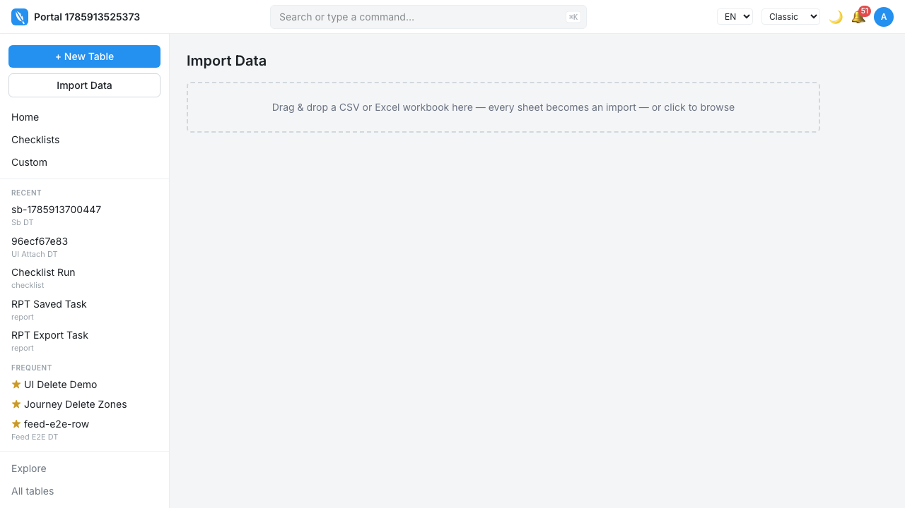
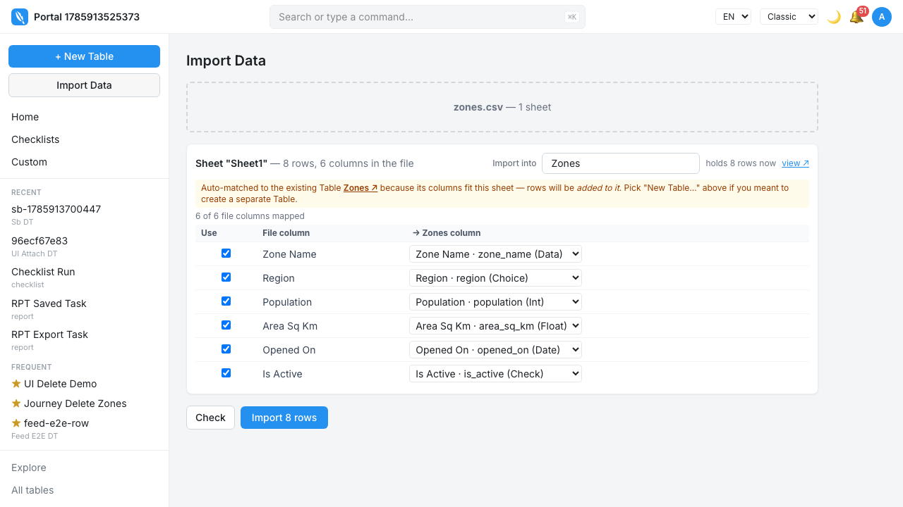
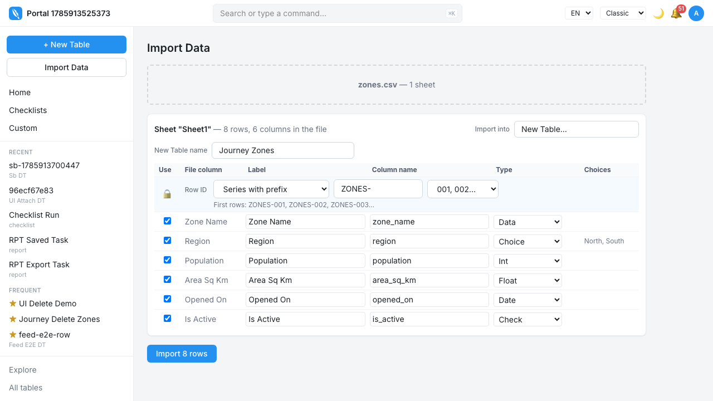
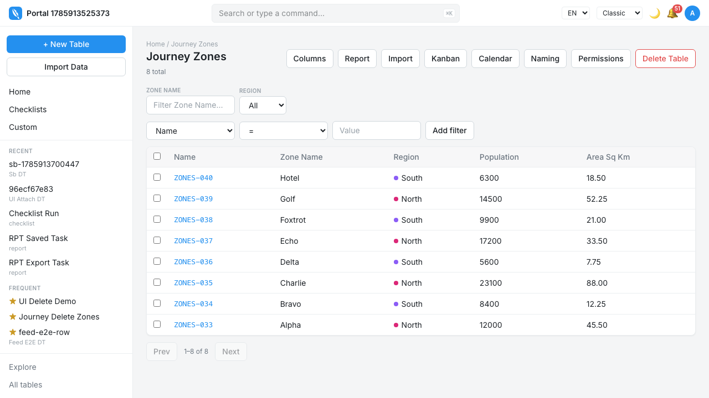

# Spreadsheet import — a field guide

This document does two jobs at once: it teaches you the whole import
pipeline end-to-end, and it is the script for testing it by hand. Work
through the journeys in order — later ones assume the state earlier ones
created, so front-to-back *is* the education.

<!--
  Slot contract (kept from the previous manual): every screenshot lives at
  docs/manual/shots/<step-id>.png. While a slot's PNG does not exist, the
  ASCII sketch below it is shown. Running a journey's e2e test with SNAP=1
  writes real screenshots into the slots; the sketch stays in this file as
  the permanent fallback and the record of the design intent.
-->

**How to read the margins.** Steps tagged **`#210`** describe behaviour
that arrives with [PR #210](https://github.com/siraj-samsudeen/featherbase/pull/210)
(the multi-sheet workflow) and are not on `main` yet — test them on the
PR's preview environment or its checked-out branch. A step with a
screenshot was witnessed in a real browser on the commit that captured it;
a step with only a sketch has not been, and proving it is exactly what a
testing session is for.

**Setup.** `./init.sh`, sign in, click **Import Data** in the sidebar.
Every file you need is in [`docs/manual/fixtures/`](fixtures/)
(regenerable — see the note at the end).

---

## Part 1 — The mental model

One screen (`/admin/import`) does everything up to the commit, and it all
happens **in your browser** — the file is parsed locally, decisions are
made locally, and only the final rows travel to the server:

```
 drop file ──▶ parse in browser ──▶ sheet overview        #210
                                    (tick sheets; separate or merged)
                  ┌─────────────────────┘
                  ▼  one target at a time                 #210
           target choice ──▶ column mapping ──▶ dry-run  ──▶ import
           (new / existing     (types inferred,   rehearsal    (chunks of
            / skip)             all editable)     (no writes)   500 rows)
                                                                  │
                       Past imports ◀── Import Log ◀──────────────┘
                       (#210: one entry per file, revert the lot)
```

Everything after the commit is bookkeeping in your favour: every run
writes an **Import Log** entry recording exactly which rows it touched,
and revert replays that list in reverse.

Deliberate limits — these are design decisions, not bugs:

- **Flat columns only.** The wizard never maps into sub-tables
  (`docs/specs/0005-import-revert.md`), which is also why revert never has
  child rows to worry about.
- **Permission is all-or-nothing per run.** If you may not write one of
  the rows, the whole request is refused — no partial silent success.
- **Nothing is ever silent.** Appending to an existing Table is always
  disclosed; a partial Table match is only ever a *suggestion*; rows
  blank in every mapped column are counted as `skipped`, not quietly
  dropped.
- **Type failures differ by target.** On a brand-new Table an odd value
  simply widens the inferred column to plain text. On a column whose type
  is already fixed, that row fails — reported by its spreadsheet row
  number — and the rest import anyway.

Inference thresholds (why a column becomes a Choice or stays text) are
named constants documented in
[ADR 0008](../adr/0008-import-inference-thresholds.md): a choice list
needs ≥ 6 samples resolving to 2–8 options at roughly 3× density; an
integer longer than 15 digits stays text; anything over 140 characters
becomes long text.

---

## Part 2 — The fixture catalog

Each file is engineered to provoke exactly one behaviour. Don't hand-craft
spreadsheets mid-session — reach in here.

| File | Shape | What it exists to provoke |
|---|---|---|
| [`zones.csv`](fixtures/zones.csv) | 8 rows, 6 columns, every inferable type | The clean happy path: Choice (North/South), Int, Float, Date, Check |
| [`zones-updates.csv`](fixtures/zones-updates.csv) | 6 rows against Zones | Upsert: 3 updates, 2 inserts, one blank cell (keep vs clear), one in-file duplicate key (Alpha twice) |
| [`zones-messy.csv`](fixtures/zones-messy.csv) | 7 rows, deliberately broken | Bad int (`twelve thousand`), bad date, a fully blank row, `maybe` in a yes/no column |
| [`zones-large.csv`](fixtures/zones-large.csv) | 1,200 rows | Chunked sending (500 rows per request) and progress reporting |
| [`store-sections.xlsx`](fixtures/store-sections.xlsx) | 6 sheets, one hidden | The whole `#210` overview: same-shaped sheets to merge, header folding (`Monthly Sales` / `monthly_sales`), a non-folding name (`Sales`) to combine by hand, a sheet carrying **both** names (the overlap rule), an odd-shaped `Summary`, and a hidden `Scratch` |

The workbook's sheets, so you know what "correct" looks like before you
drop it:

| Sheet | Headers | Role |
|---|---|---|
| Anna Nagar | Section, Items, Monthly Sales | merge member |
| T Nagar | section, items, monthly_sales | folds into the same columns |
| Velachery | Section, Items, **Sales** | folding can't pair `Sales` — you combine it manually |
| Adyar | Section, Items, **Sales, Monthly Sales** | carries both — forces the `first` / `join` rule |
| Summary | Store, Total Sales | different shape; belongs alone |
| Scratch | scratch, notes | **hidden** — should appear collapsed, unticked |

---

## Part 3 — The journeys

### Journey 1 · First import: one CSV becomes a new Table

*Witnessed by `apps/web/e2e/import-journey.spec.ts`; screenshots captured
2026-08-05.*

**Fixture:** `zones.csv` · **Starting state:** no Zones Table exists.

1. **Open the import screen.** Click **Import Data** — an empty drop
   area.

   
   <!-- slot: IMP-J1.1 → shots/IMP-J1.1.png -->

2. **Drop `zones.csv`.** Featherbase reads it immediately and shows what
   it found — *these counts describe your file*; nothing has been
   imported yet. Try dropping a PDF first: it is refused by name
   (*notes.pdf: not a CSV or Excel file*) and nothing changes.

   
   <!-- slot: IMP-J1.2 → shots/IMP-J1.2.png -->

3. **Check the target.** With no matching Table anywhere, it reads
   **New Table…** with a name derived from the file — `zones.csv` becomes
   **Zones**. Rename it if you like.

   
   <!-- slot: IMP-J1.3 → shots/IMP-J1.3.png -->

4. **Review the columns.** A type was guessed for every column from its
   values; every row of the grid is editable and any column can be
   dropped.

   
   <!-- slot: IMP-J1.4 → shots/IMP-J1.4.png -->

   You should see: Region became a **Choice** (exactly North, South),
   Population **Int**, Area Sq Km **Float**, Opened On **Date**,
   Is Active **Check**.

5. **Check the Row ID.** A locked row previews the id series named after
   your Table — `ZONES-###`. Rename the Table and the series follows.

   
   <!-- slot: IMP-J1.5 → shots/IMP-J1.5.png -->

6. **Import.** The button already counted your file: **Import 8 rows**.

   
   <!-- slot: IMP-J1.6 → shots/IMP-J1.6.png -->

7. **Land in the data.** A single-sheet import navigates you straight to
   the new Table's list — eight rows, each with its `ZONES-…` id. Open
   one: Region is a dropdown offering exactly North and South, Is Active
   a real tick box, Opened On still the calendar day from the file
   whatever timezone the server runs in.

   
   <!-- slot: IMP-J1.7 → shots/IMP-J1.7.png -->

> **Why it works this way** — inference is generous but never binding:
> every guess is shown and editable *before* anything is written, and the
> Row ID row is locked because ids are the one thing an import must never
> improvise.

---

### Journey 2 · A workbook of many sheets, kept separate — `#210`

*Sourced from PR #210 (#198–#201). Not yet witnessed on `main`.*

**Fixture:** `store-sections.xlsx` · **Starting state:** after Journey 1.

1. **Drop the workbook.** You land on a **sheet overview**, not a wall of
   column grids. One line per sheet: name, row count, column count, and
   the first few headers as a shape hint.
   <!-- slot: IMP-J2.1 → shots/IMP-J2.1.png -->

   ```
   ☐ Anna Nagar   4 rows · 3 cols   Section, Items, Monthly Sales
   ☐ T Nagar      3 rows · 3 cols   section, items, monthly_sales
   ☐ Velachery    3 rows · 3 cols   Section, Items, Sales
   ☐ Adyar        3 rows · 4 cols   Section, Items, Sales, …
   ☐ Summary      4 rows · 2 cols   Store, Total Sales
   ▸ Hidden sheets (1)
   ```

2. **Nothing is ticked.** This is the point — the old wizard included
   every sheet by default, and one seventeen-sheet workbook once created
   eleven Tables nobody asked for.

3. **Hidden stays hidden.** `Scratch` sits below in its own collapsed
   section. (`very hidden` sheets — settable only from VBA — are labelled
   distinctly if you ever meet one.)

4. **Tick `Summary` only** and continue. One target on screen, exactly
   like Journey 1's steps 3–6. Import it.

5. **Now tick the four section sheets.** With two or more ticked, the
   overview asks outright: **separate Tables, or merged into one?**
   Choose *separate* this time and continue.

6. **Walk the targets one at a time.** "Table 2 of 4", Previous/Next, and
   a strip showing every target — done, failed, or pending — clickable to
   jump. Import the first target alone ("Import 4 rows into Anna Nagar"),
   click through to its rows, come back: **everything is where you left
   it**. The bulk button now reads "Import the remaining N Tables" and
   skips what already landed.
   <!-- slot: IMP-J2.6 → shots/IMP-J2.6.png -->

7. **Results live below the card**, in a "This import" panel — with one
   card on screen, the card that made a result is the wrong place to keep
   it.

> **Why it works this way** — importing per target as you walk means a
> seventeen-sheet file never becomes an all-or-nothing gamble; each sheet
> is a decision you actually made.

---

### Journey 3 · Same-shaped sheets merged into one Table — `#210`

*Sourced from PR #210 (#200, #201, #211). Not yet witnessed.*

**Fixture:** `store-sections.xlsx` again · **Starting state:** delete the
Tables Journey 2 created (or use Past imports → revert, Journey 6).

1. **Tick Anna Nagar, T Nagar, Velachery and Adyar**, choose **Merged
   into one Table**, name it *Store Sections*.

2. **Watch the folding.** `Monthly Sales` and `monthly_sales` become one
   column — folding covers case, spaces, underscores and punctuation
   *only*. `Sales` (Velachery) stays a separate column: beyond folding,
   nothing is guessed.
   <!-- slot: IMP-J3.2 → shots/IMP-J3.2.png -->

3. **Combine by hand.** Tick `Sales` and `Monthly Sales`, name the result
   (say, `Monthly Sales`), combine. The panel shows **sample values**
   from each — that's how you confirm they really are the same thing,
   which is exactly what folding could never know.

4. **The overlap is named, not resolved silently.** Adyar carries *both*
   columns, so a rule is required before you can continue:
   - **`first`** — priority with fallback: the winner's value is taken,
     but a blank in the winner does not blank a row the other could
     answer. (Check Adyar's rows: Produce has only `Sales`, Dairy only
     `Monthly Sales`, Bakery both.)
   - **`join`** — both values, joined.

5. **Import the group.** It imports **member by member**, never as one
   blended batch — the Import Log keeps one part per sheet under a shared
   `run_id`. Provenance survives; one revert takes back the whole group.

> **Why it works this way** — `Store Code` (STR-009) and `Store Name`
> (Anna Nagar) look nothing alike, which is why nothing auto-proposes
> combinations, and why a sheet carrying both members of a pair is
> treated as the data-loss case it is.

---

### Journey 4 · Into an existing Table: append and upsert

*Witnessed by `import-upsert-journey.spec.ts` and
`import-typed-confirmation.spec.ts` on `main`.*

**Fixture:** `zones-updates.csv` · **Starting state:** the Zones Table
from Journey 1.

1. **Drop it.** The matching Table is **already selected** — its columns
   match well enough (score ≥ 0.6 covering ≥ 80% of the file's columns)
   to auto-match — with a visible notice that rows will be **added** to
   it. Weaker matches (≥ 0.3) appear only as suggestions, at most three,
   never applied for you. A Table's own **Import** button pre-selects
   that Table.
   <!-- slot: IMP-J4.1 → shots/IMP-J4.1.png -->

2. **Choose a key column** — `Zone Name` — to turn append into upsert.
   (The Row ID itself can also serve as the key.)

3. **Rehearse.** The dry run validates every row and reports
   valid / inserted / updated / failed — plus `skipped` for rows blank in
   every mapped column — **without writing anything**. Expect: 2 inserts
   (India, Juliet), 3 updates, and the duplicate Alpha row **failed** —
   a key that appears twice in one file is failed up front, because split
   across request chunks it would otherwise become a silent update.
   <!-- slot: IMP-J4.3 → shots/IMP-J4.3.png -->

4. **Decide about blank cells.** Delta's Population is empty: choose
   whether blanks **keep** the existing value or **clear** it. Verify
   afterwards on the Delta row.

5. **The typed confirmation.** More than 20 rows about to be *updated*
   makes the import button demand you type the number back. To see it,
   re-import `zones-large.csv` into its own Table twice with a key — the
   second pass is 1,200 updates.
   <!-- slot: IMP-J4.5 → shots/IMP-J4.5.png -->

6. **Import, then check invariants:** existing rows kept their Row IDs
   (an upsert may never change one), and the Import Log entry records the
   run with its counts and choices.

> **Why it works this way** — updates are the destructive half of upsert:
> everything before the write is reversible reading, so that's where all
> the friction lives.

---

### Journey 5 · Things going wrong

*Row numbering and per-row failure witnessed by
`import-row-numbers.spec.ts` and `import-file.spec.ts`; the per-target
failure isolation is `#210` (#203, #205).*

**Fixture:** `zones-messy.csv`.

1. **Into a brand-new Table** first: nothing fails — the odd values just
   widen their columns (Population infers as text because of `twelve
   thousand`). Delete the Table afterwards.

2. **Now into the existing Zones Table**, whose types are fixed. The bad
   rows fail **by their spreadsheet row number** — the number you'd see
   in Excel, header row accounted for — while the good rows (Kilo,
   November, Papa) import anyway. Five failures show on screen; the rest
   live in the Import Log.
   <!-- slot: IMP-J5.2 → shots/IMP-J5.2.png -->

3. **The blank row** (row 5 in the file) is reported as `skipped`, not an
   error and not silently dropped.

4. **`#210` — one target failing doesn't take the run down.** In a
   multi-sheet walk, a target that throws fails *alone*: the others still
   run, the run reports whenever it stops, and the **Import Log link sits
   permanently under the dropzone** — it used to vanish in exactly the
   crash that made it matter.

5. **`zones-large.csv`** into a new Table: watch the progress advance in
   chunks (500 rows per request, 3 requests).

> **Why it works this way** — errors are named in *your* coordinates
> (Excel row numbers), and a fixed-type column failing a row beats a
> fixed-type column silently mangling one.

---

### Journey 6 · Walking away and coming back — `#210`

*Sourced from PR #210 (#204). Not yet witnessed.*

**Fixture:** `store-sections.xlsx`, mid-Journey-3.

1. **Leave mid-wizard** — navigate to any Table, then return to Import
   Data. Your decisions (ticks, merge choice, names, column edits) and
   the file's rows are both restored; you continue where you stopped.

2. **The rows are the half allowed to fail.** They're kept in
   sessionStorage, and a very large workbook doesn't fit. When that
   happens you are told **before you leave**, not on return: decisions
   survive, and you're asked for the file again.

3. **Re-drop is verified, not trusted.** The saved plan addresses sheets
   by position, so the re-dropped file must match by name, sheet names,
   headers and row counts before the plan is applied. Try re-dropping
   `zones.csv` instead: the plan must refuse it.

> **Why it works this way** — silently applying a saved plan to a
> different file would import the wrong data with full confidence; the
> plan is only as good as the file it was made against.

---

### Journey 7 · Afterwards: the log, revert, and reshaping

*Revert witnessed by `import-revert-journey.spec.ts` on `main`; Past
imports, column rename and Table merge are `#210` (#206–#209).*

1. **Revert a run.** From the import history, revert first **rehearses**
   — showing exactly what would be taken back — then does it. Rows
   **edited since the import** are skipped and named by Row ID (their
   version stamp no longer matches), as are rows already deleted; an
   explicit override list can force the edited ones.
   <!-- slot: IMP-J7.1 → shots/IMP-J7.1.png -->

2. **`#210` — Past imports.** The sidebar page shows each file-level
   import: which Tables it **created** and which it merely **added to**,
   with one action to delete everything it created — and *only* what it
   created, because a Table that only received rows is undone by the
   per-run revert, not deletion.

3. **`#210` — reshape a populated Table.** Add a column, relabel one, and
   **rename** one on a Table that already has rows — then check the data
   survived the rename. (This needed real server work: column matching is
   by name, so a rename used to read as delete-plus-add and orphan the
   data.)

4. **`#210` — merge one Table into another.** A post-hoc merge *is* an
   import whose source is a Table instead of a file — so it gets
   chunking, per-row failures, an Import Log entry and revert for free.
   Folding pairs what it can; `Glor` and `Floor` stay apart until you say
   otherwise.

> **Why it works this way** — every write path funnels through the same
> import machinery, so "can I undo this?" has one answer everywhere.

---

## Part 4 — The tracking matrix

Copy this table into your testing notes (or tick it in place on a
branch). **Confused** is a first-class outcome — for this feature it's
the more valuable one.

| # | Journey | Needs #210 | Date tested | Result (pass / fail / confused) | Notes |
|---|---|---|---|---|---|
| 1 | First import → new Table | no | | | |
| 2 | Workbook, sheets kept separate | yes | | | |
| 3 | Sheets merged into one Table | yes | | | |
| 4 | Append and upsert | no | | | |
| 5 | Things going wrong | partly (step 4) | | | |
| 6 | Walking away and coming back | yes | | | |
| 7 | Log, revert, reshaping | partly (steps 2–4) | | | |

---

*Screenshots are produced by the journey tests: `SNAP=1 pnpm exec
playwright test e2e/import-journey.spec.ts` fills Journey 1's slots
today; new slots fill as #210's journey tests gain `snap()` calls. The
fixtures are generated — if they need changing, edit
[`fixtures/make-fixtures.mjs`](fixtures/make-fixtures.mjs) and re-run it
(`node docs/manual/fixtures/make-fixtures.mjs "$PWD"` from the repo root)
rather than hand-editing the files. Deeper reading: `docs/specs/0004-import-upsert.md`,
`docs/specs/0005-import-revert.md`,
[ADR 0008](../adr/0008-import-inference-thresholds.md).*
